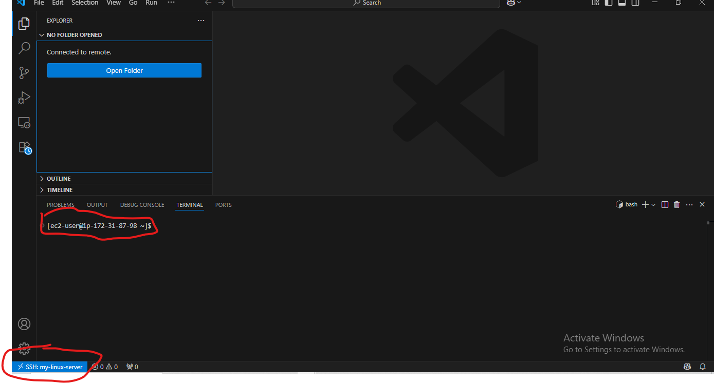
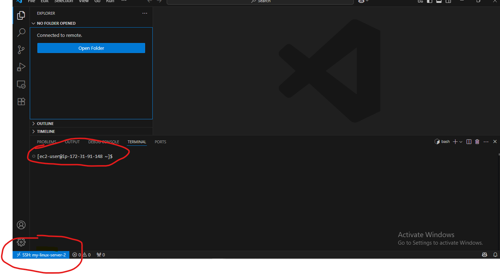

# 🚀 AWS EC2 SSH via VS Code (Windows) — Complete Lab Guide

## 📝 Quick Note:

First of, I'll like you to know that this particular lab is important to me. I know I'll spend most of my days on collaborating and sharing Cloud Projects with other talented project team; so, this starts the journey on platforms like the VS Code, Git Bash and GitHub: committing a substantial part of my day to leanring these technical skils.

Are you an enthuastic Cloud or DevOps Engineer like me? I have written this Complete Lab Guide in such a way you can follow along. It took me some good minutes to complete plus some gentle troubleshootings 😂. With this guide, you will spend less time ⌚. Just follow thoroughly. ⚠ This lab is part of my EC2 lab series on methods to **securely connect to AWS EC2 remotely.**

## 📋 Must Have:

- ✅ AWS Account
- ✅ AWS EC2 Instance (Amazon Linux 2 or Ubuntu)
- ✅ Private Key (`.pem` file) from AWS
- ✅ Visual Studio Code (VS Code) installed
- ✅ VS Code Remote - SSH extension installed
- ✅ AWS CLI (optional) + OpenSSH

---

## 1️⃣ Launch a New EC2 Instance

1. Go to AWS Console → **EC2 → Instances → Launch Instance**.
2. Choose:
    - **Amazon Linux 2023** or **Ubuntu 22.04**.
3. Select instance type: `t2.micro` (Free Tier).
4. **Key Pair**:
    - Create a new key pair or reuse an existing `.pem`.
5. Configure Security Group:
    - Allow **SSH (port 22)** from `0.0.0.0/0` (or your IP for better security).
6. Launch the instance.

---

## 2️⃣ Get EC2 Public DNS

Find your instance in AWS Console → EC2 → **Public IPv4 DNS**.

Looks like this:
```
ec2-3-95-123-45.compute-1.amazonaws.com
```

---

## 3️⃣ Prepare the `.pem` Key

Move the downloaded `.pem` file to:

```
C:\Users\<YourWindowsUsername>\.ssh\
```

Fix file permission (in Git Bash or WSL):

```bash
chmod 400 C:/Users/<YourWindowsUsername>/.ssh/your-key.pem
```

---

## 4️⃣ Configure SSH in VS Code

1. Open VS Code → Command Palette (`Ctrl+Shift+P`).
2. Select:
```
Remote-SSH: Open SSH Configuration File
```
3. Choose:
```
C:\Users\<YourWindowsUsername>\.ssh\config
```

4. Add a block for your EC2 instance:

```ssh
Host my-ec2
    HostName ec2-3-95-123-45.compute-1.amazonaws.com  # Replace with your EC2 Public DNS
    User ec2-user                                      # For Amazon Linux (or 'ubuntu' for Ubuntu AMI)
    IdentityFile C:/Users/<YourWindowsUsername>/.ssh/my-key.pem
```

---

## 5️⃣ SSH into EC2 via VS Code

1. Open Command Palette (`Ctrl+Shift+P`).
2. Select:
```
Remote-SSH: Connect to Host...
```
3. Choose:
```
my-ec2
```

VS Code will open a remote window connected to your EC2 instance.

---

## 🙋‍♀️ Success

**WE WON!**

## 🖼 Screenshot



---

## 6️⃣ Verify Connection

Open Terminal (`` Ctrl + ` ``) and run:

```bash
whoami
uname -a
hostname
```

---

## 7️⃣ Launch and Connect to a Second EC2 Instance

### 1. Repeat **Steps 1-3** to create another EC2.

### 2. Add to your SSH config:

```ssh
Host my-ec2-second
    HostName ec2-3-22-75-129.compute-1.amazonaws.com  # New EC2 DNS
    User ec2-user
    IdentityFile C:/Users/<YourWindowsUsername>/.ssh/my-key.pem  # Or new .pem if used
```

### 3. Connect via:

```
Remote-SSH: Connect to Host... → my-ec2-second
```

---


## ⚠️ Troubleshooting

| Problem                               | Solution                                |
|--------------------------------------|----------------------------------------|
| Permission denied (publickey)         | Ensure `.pem` is `chmod 400`            |
| Timeout or Stuck on Connecting        | Check Security Group → Port 22 allowed |
| Cannot resolve hostname               | Verify EC2 DNS                         |
| Wrong username                        | Use `ec2-user` (Amazon Linux) or `ubuntu` (Ubuntu) |

---

## ✅ Summary Table

| Step | Action                                  |
|------|----------------------------------------|
| 1    | Launch EC2 Instance                     |
| 2    | Get Public DNS                          |
| 3    | Place and set permissions on `.pem` key |
| 4    | Configure SSH in VS Code                |
| 5    | SSH via VS Code Remote-SSH              |
| 6    | Verify & manage multiple EC2 instances  |

---

## 📚 References

- [AWS EC2 Connect Docs](https://docs.aws.amazon.com/AWSEC2/latest/UserGuide/AccessingInstancesLinux.html)
- [VS Code Remote-SSH Docs](https://code.visualstudio.com/docs/remote/ssh)

---

## 🙌 Author

Created by: Ayodele Adewuyi
— Budding Cloud & AI Engineer
